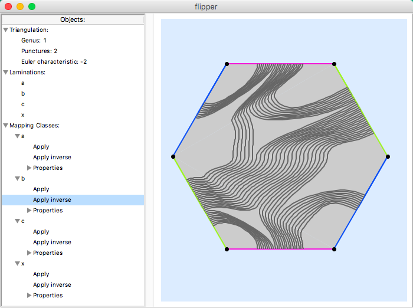
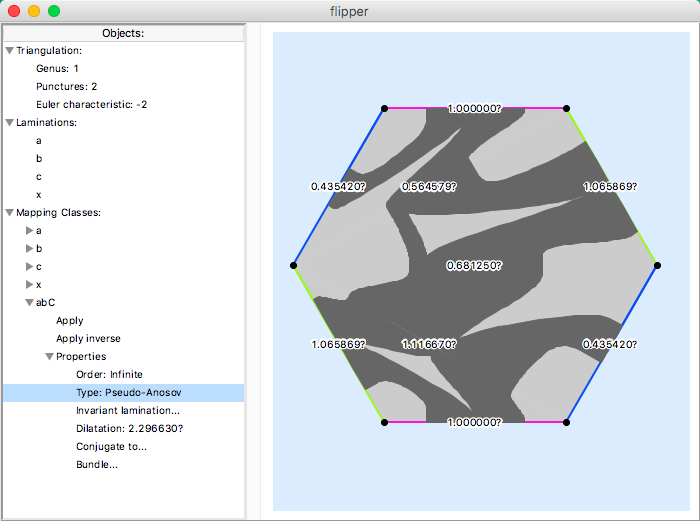

A taste of flipper
==================

The flipper GUI can be started by using the command::

    > flipper.app

flipper includes many pre-made examples under the ``File > Open example...`` menu.
For example the twice-punctured torus is show below.
Here we can apply mapping classes directly to curves drawn on the surface.

flipper can also create new mapping classes by composing together old ones.
Additionally, several of their properties, including their Nielsen--Thurston type and dilatation, can be computed.
 

However, to access the full power of flipper it should be imported into a Python interpreter::

    >>> import flipper
    >>> S = flipper.load('S_1_2')
    >>> h = S.mapping_class('abC')
    >>> h.nielsen_thurston_type()
    'Pseudo-Anosov'
    >>> d = h.dilatation()
    >>> d
    2.296630?
    >>> d.approximate_string(accuracy=50)
    '2.29663026288653824570494191773617027122260685258284?'
    >>> d.minimal_polynomial()
    1 - 2*x - 2*x^3 + x^4
    >>> h.hitting_matrix()
    [
    [0, 0, 0, 0, 1, 0, 0, 0, 0, 0, 0, 0],
    [1, 0, 0, 0, 0, 0, 0, 0, 0, 0, 0, 0],
    [0, 1, 0, 0, 0, 0, 0, 0, 0, 0, 0, 0],
    [0, 0, 0, 1, 0, 0, 1, 0, 0, 1, 0, 0],
    [0, 0, 1, 1, 0, 1, 0, 1, 0, 0, 0, 1],
    [0, 0, 0, 0, 0, 0, 0, 0, 0, 0, 0, 1],
    [0, 1, 1, 1, 0, 0, 0, 0, 1, 0, 0, 1],
    [0, 0, 0, 1, 0, 0, 0, 0, 0, 0, 0, 0],
    [0, 0, 0, 0, 0, 0, 0, 1, 0, 0, 0, 0],
    [0, 0, 0, 0, 0, 1, 0, 0, 0, 0, 0, 0],
    [0, 1, 1, 1, 0, 0, 0, 0, 0, 1, 0, 1],
    [0, 0, 0, 0, 0, 0, 0, 0, 1, 0, 1, 1]
    ]

Here we can also access large censuses of monodromies::

    >>> census = flipper.census('knot_monodromies')  # Census of fibred knots.
    >>> for s, w, _ in census:
    ...     h = flipper.load(s).mapping_class(w)
    ...     if h.dilatation() < 1.2:
    ...             print(s, w)
    ... 
    ('S_5_1', 'abcdefghil')  # There is only one known example of a fibred knot whose monodromy has dilatation < 1.2.
    

These are great for finding unusual examples and counter-examples to conjectures.
You can build more using::

    census = S.all_mapping_classes(length=5)

